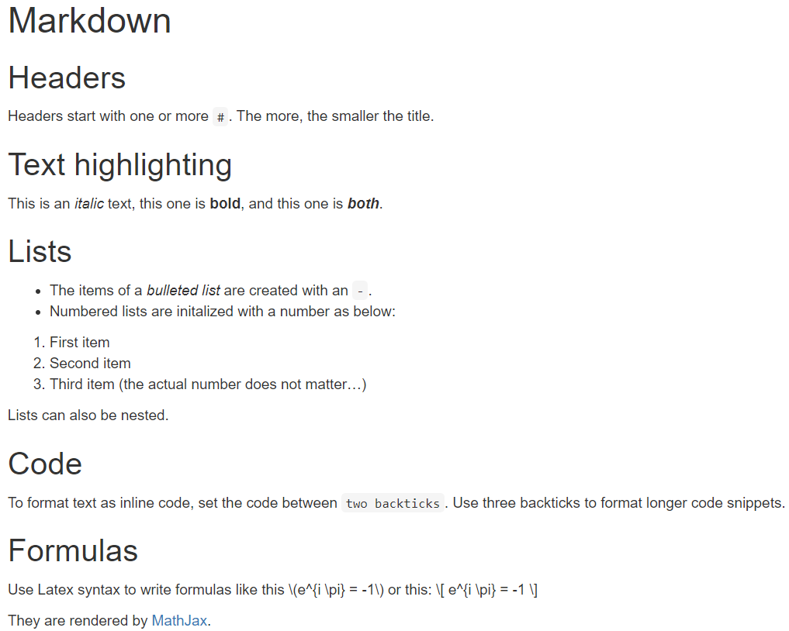

```{r setup, include=FALSE}
knitr::opts_chunk$set(
  echo = TRUE, 
  warning = FALSE,
  message = FALSE, 
  fig.height = 5,
  fig.width = 6,
  eval = TRUE
)
```

# Introduction

The aim of the first chapter is to refresh your R skills. It is split into two sections: "Data Analysis" and "Writing Functions".

You can download R from [The Comprehensive R Archive Network](https://cran.r-project.org/) CRAN. 

{width=30%}

# Data Analysis

In the first section, our focus is on *data preparation* and *descriptive analysis*, an essential part of every (good) analysis. Base R has hundreds of functions to help you with these aspects. We take additional support from the following contributed extension packages:

|Package  |Task              |Initial CRAN release |Creator            | 
|:-:      |:-:               |:-:                  |:-:                |
|magrittr |pipe `%>%`        |2014                 |Stefan Milton Bache|
|dplyr    |data preprocessing|2014                 |Hadley Wickham     |
|ggplot2  |beautiful plots   |2007                 |Hadley Wickham     |
|rmarkdown|dynamic reports   |2014                 |Yihui Xie          |

## Base R

Let's start with a small selection of helpful functions in base R for data preparation and descriptive analysis:

- `subset()`: Select rows and columns of data frame
- `transform()`: Add or overwrite columns in data frame
- `aggregate()`, `tapply()`, `rowsum()`, `by()`: Grouped calculations
- `ave()`: Grouped transformations
- `rbind()`, `cbind()`: Bind rows/columns of data frame/matrix
- `merge()`: Join data frames by key
- `expand.grid()`: Cross-join lists/data frames
- `head()`, `tail()`: First/last few elements of object
- `nrow()`, `ncol()`, `dim()`: Number of rows/columns of data frame/matrix
- `order()`, `rank()`: Sort indices, ranks
- `rowSums()`, `rowMeans()`: Row-wise sums/means of data frame/matrix
- `colSums()`, `colMeans()`: Column-wise sums/means data frame/matrix
- `cumsum()`: Cumulative sums of vector
- `reshape()`: Transposition/Reshaping of data frame (tricky interface)
- `lapply()`: Apply function element-wise, e.g., per column of data frame
- `str()`: Structure of object, e.g., of a data frame
- `summary()`: Summarizes object, e.g., each column in a data frame
- `mean()`, `median()`, `sd()`, `quantile()`, `min()`, `max()`: Univariate statistics
- `table()`, `prop.table()`, `addmargins()`: Absolute and relative counts
- `cor()`, `cov()`: Bivariate statistics 
- `hist()`, `barplot()`, `boxplot()`, `plot()`: Some plot functions

### Example: diamonds

To see some of these functions in action, we will peak into the diamonds data that is part of the "ggplot2" package. We are mainly interested in the column "price" and the four "C"-variables: Carat, Color, Cut, and Clarity. Each observation/row represents a diamond.

```{r}
library(ggplot2)

head(diamonds)
nrow(diamonds)
str(diamonds)
summary(subset(diamonds, select = c(price, carat, color, clarity, cut)))

# Univariate plots
hist(diamonds$price, breaks = "FD", col = "chartreuse4")
hist(diamonds$carat, breaks = "FD", col = "chartreuse4")

for (x in c("color", "clarity", "cut")) {
  barplot(table(diamonds[[x]]), main = x, col = "chartreuse4")
}

# Bivariate plots
plot(price ~ carat, data = diamonds, col = "chartreuse4", pch = ".", xlim = c(0, 3))
plot(
  price ~ carat, 
  data = diamonds, 
  col = "chartreuse4", 
  pch = ".", 
  log = "xy", 
  main = "log-log scale"
)

for (x in c("color", "clarity", "cut")) {
  boxplot(
    reformulate(x, "price"),
    varwidth = TRUE,
    data = diamonds, 
    main = paste("price by levels of", x), 
    col = "chartreuse4"
  )
}
```

**Comments** 

- The data set has 53'940 rows. It appears to be sorted by price.
- "carat" and "price" are numeric variables, while "color" is an ordered categorical with categories D < E < F < G < H < I < J (D is the best color). "cut" is also ordered with categories Fair < Good < Very Good < Premium < Ideal, and
"clarity" is ordered with categories I1 < SI2 < SI1 < VS2 < VS1 < VVS2 < VVS1 < IF (best, internally flawless).
- The average diamond price is 3933 USD. About half of the diamonds cost less/more than the median of 2401 USD and about half of them cost between 950 USD (first quartile) and 5324 USD (third quartile). The lowest price is 326 USD, the highest price is 18'823 USD.
- Prices and carats show a *right-skewed* distribution with a few very large values.
- The relationship between price and carat seems quite strong and positive, which makes sense. On log-log scale, it looks linear.
- The worst categories of `color`, `cut`, and `clarity` are rare.
- Prices tend to be lower for nice colors, nice cuts, and also for nice clarities. This unintuitive behaviour will later be entangled by our regression models

## The pipe

{width=20%}

One of the most downloaded contributed extension packages of all times is ["magrittr"](https://magrittr.tidyverse.org/). It provides the forward pipe operator `%>%`. The pipe puts the object in front of it as the first argument in the function after it. Thus, `X %>% f(...)` is the same as `f(X, ...)`. In this way, the pipe helps to turn a nested function call into a sequence of simple calls. 

**Remarks**

- Don't make too long chains.
- In RStudio, the shortcut for the pipe is "ctrl + shift + m".
- In the function after the pipe, the piped object can be referred to by a dot `.`
- Since R 4.1, base R also contains a pipe operator: `|>`. The piped object can be referred to by `_`. 

### Example

```{r}
library(ggplot2)
library(magrittr)

# Same as head(diamonds, 2)
diamonds %>% 
  head(2)

# Not too spectacular. But what about these expressions?
diamonds %>% 
  subset(select = c(price, carat, color, clarity, cut)) %>% 
  summary()

diamonds$color %>% 
  table() %>% 
  prop.table() %>% 
  barplot(col = "chartreuse4")

# The alternative to the last expression would be a nested construction like this:
# barplot(prop.table(table(diamonds$color)), col = "chartreuse4")

# Or a repeated assignment:
# x <- table(diamonds$color)
# x <- prop.table(x)
# barplot(x, col = "chartreuse4")

# Voila the new base R pipe:
iris |> 
  head(2)

# Beautifully implemented:
quote(iris |> head(2))
```

The pipe shines when it comes to data preprocessing, as this often consists of several steps. We will see this in the following.

## dplyr

{width=20%}

An other helpful R package is ["dplyr"](https://dplyr.tidyverse.org/) (Grammar of Data Manipulation). It provides a rich set of data preprocessing functions. Here is a selection:

- **`select()`**: Select or drop columns
- **`filter()`**: Select rows by condition
- **`arrange()`**: Sort by one or more columns
- **`mutate()`**: Create or overwrite columns
- **`summarize()`**: Summary statistics
- `rename()`: Rename columns
- `transmute()`: Transform columns and selects only those
- `group_by()`, `ungroup()`: Groups the rows by levels of one or more columns. Plays well with other functions like `summarize()`or `mutate()`
- `bind_rows()`, `bind_cols()`: Bind data frames by row/column
- `left_join()`, `inner_join()`, `right_join`: Join by key
- `slice()`: Select rows by position
- `pivot_wider()`, `pivot_longer()`: Reshape/transpose (in "[tidyr](https://tidyr.tidyverse.org/)", not "dplyr")

These "verbs" always take a data frame as their first argument and return a data frame, which makes it easy to work with the pipe.

Together with "magrittr", "tidyr" (for restructuring data), "ggplot2" (beautiful plots), and some other packages, "dplyr" is part of the [tidyverse](https://www.tidyverse.org/). Its packages can be loaded with the command `library(tidyverse)`. See @wickham2017 for a great reference on the tidyverse.

### Example

Let's have some "dplyr" fun with diamonds.

```{r}
library(tidyverse)

# Price and carat of the two most expensive diamonds
diamonds |>
  select(price, carat) |> 
  arrange(-price) |> 
  slice(1:2)

# Select diamonds >2 carat and calculate log(price) and log(carat)
# Possible simplification: transmute() = mutate() + select()
diamonds |> 
  filter(carat > 2) |> 
  mutate(
    log_price = log(price), 
    log_carat = log(carat)
  ) |> 
  select(log_price, log_carat) |> 
  slice(1:2)  # Show first two rows only

# Median carat and price
diamonds |> 
  summarize(
    med_carat = median(carat), 
    med_price = median(price)
  )

# Same grouped by clarity
med <- diamonds |> 
  group_by(clarity) |> 
  summarize(
    med_carat = median(carat), 
    med_price = median(price)
  )
med 

# Join medians to original data by using clarity as key
# We only use price and the four "C" variables
diamonds |>
  select(price, starts_with("c")) |> 
  left_join(med, by = "clarity") |>
  slice(1:2)  # Show first two rows only

# Directly with a grouped mutate (imagine this without pipe...)
diamonds |>
  select(price, starts_with("c")) |> 
  group_by(clarity) |> 
  mutate(
    med_carat = median(carat),
    med_price = median(price)
  ) |> 
  ungroup() |> 
  slice(1:2)  # Show first two rows only

# Turn all ordered factors into unordered
dia <- diamonds |> 
  mutate_if(is.ordered, factor, ordered = FALSE)

# Stack price and carat using the function pivot_longer() in "tidyr"
# -> will need this later
diamonds_long <- diamonds |> 
  select(price, carat) |> 
  pivot_longer(everything())

head(diamonds_long, 4)
```

### Translator

The following table helps to translate between base R and "dplyr". It also includes other technologies that we will meet later: "data.table" for fast data processing, and the data query language *SQL*.

|Task                | base R           | dplyr                |  data.table           | SQL             | 
|:-                  |:-:               |:-:                   |:-:                    |:-:              |
|Pick columns        |`subset`/`[cols]` |`select`              |`X[, cols]`            |`SELECT`         |
|Transform columns   |`transform`/`<-`  |`mutate`              |`X[, z := ...]`        |`SELECT`         |
|Rename a column     |depends...        |`rename`              |`setnames`             |`AS`             |
|Filter on condition |`subset`/`[cond,]`|`filter`              |`X[cond]`              |`WHERE`          |
|Bind rows           |`rbind`           |`bind_rows`           |`rbindlist`/`rbind`    |`UNION ALL`      |
|Bind columns        |`cbind`           |`bind_cols`           |`cbind`                |Join on row id   |
|Left join           |`merge(, all.x=T)`|`left_join`           |`merge`/`[]`           |`LEFT JOIN`      |
|Inner join          |`merge`           |`inner_join`          |`merge`/`[]`           |`INNER JOIN`     |
|Grouped stats       |`aggregate`       |`group_by`+`summarize`|`[, ..., by = ]`       |`GROUP BY`       |
|Grouped trafo       |`ave`             |`group_by`+`mutate`   |`[, := , by = ]`       |`PARTITION OVER`*|
|Reshape wide to long|`reshape`         |`pivot_longer`**      |`melt`                 |`UNPIVOT`*       |
|Reshape long to wide|`reshape`         |`pivot_wider`**       |`dcast`                |`PIVOT`*         |
|Sort by z           |`X[order(), ]`    |`arrange`             |`X[order()]`/`setorder`|`ORDER BY`       |
|Top m rows          |`head`            |`slice`               |`X[1:m]`               |`LIMIT`*         |

- *: not available in all SQL implementations
- **: In the related package "tidyr"

## ggplot

{width=20%}

["ggplot2"](https://ggplot2.tidyverse.org/) (Grammar or Graphics) is THE package for drawing beautiful figures. The main difference to the standard plotting functions in R is the use of `+` to modify the plot layer per layer. This logic was suggested in the "grammar of graphics" [@wilkinson05] and then implemented by Hadley Wickham in "**gg**plot2".

**Remarks**

- "ggplot2" is built on top of the standard plot package "graphics".
- It was released on CRAN in 2007, long before the introduction of the pipe operator. Nowadays, it would have been more natural to use the pipe instead of a `+` to concatenate the layers.

We will introduce "ggplot2" using examples. For more information, see again @wickham2017.

### Example

Let's use "ggplot2" to plot diamonds data.

```{r}
library(tidyverse)

# The minimum: a data set, an aesthetic mapping, and a geometry
# -> "make a bar plot, using color on the x axis"
ggplot(data = diamonds, mapping = aes(x = color)) +
  geom_bar(fill = "chartreuse4")

# A histogram -> store as object "p" to modify it later
p <- ggplot(diamonds, aes(x = price)) +
  geom_histogram(fill = "chartreuse4", bins = 30)
p

# "Add" title
p + ggtitle("Histogram of price")

# Boxplot of price per color
p <- ggplot(diamonds, mapping = aes(x = color, y = price)) +
  geom_boxplot(fill = "chartreuse4", varwidth = TRUE)
p

# Same but with larger text. Other settings can be changed by + theme()
p + theme_gray(base_size = 15)

# Attention: + ylim() would clip the data *before* calculating statistics
# It is usually better to clip the coordinate system:
p + coord_cartesian(ylim = c(0, 8000))

# Scatterplot of price against carat (on log-log scale)
p <- ggplot(diamonds, mapping = aes(x = carat, y = price)) +
  geom_point(color = "chartreuse4", alpha = 0.2, shape = ".") +
  scale_x_log10() +
  scale_y_log10() +
  ggtitle("Scatterplot on log-log scale")
p

# A ggplot can use any number of geometries (even with different data sets each)
# Here, we add a scatterplot smoother (a type of regression)
p + geom_smooth()
```

One of the strengths of "ggplot2" are grouped plots using `facet_wrap()` and `facet_grid()`. Creating a scatterplot per color? Just add a `facet` layer:

```{r}
p + facet_wrap(~ color)
```

Combining faceting with data reshaping, we can draw histograms of multiple variables:

```{r}
diamonds |> 
  select(price, carat) |> 
  pivot_longer(everything()) |> 
ggplot(aes(value)) +
  geom_histogram(fill = "chartreuse4", bins = 29) +
  facet_wrap(~ name, scale = "free_x")
```

Another strength of "ggplot2" is that we can map columns not only to x and y coordinates, but also to aspects such as color, fill, alpha (transparency), shape, linetype and size:

```{r}
# Here, "color" refers to the function argument, not the column name in diamonds
ggplot(diamonds, mapping = aes(x = carat, y = price, color = clarity)) +
  geom_point(alpha = 0.2) +
  scale_x_log10() +
  scale_y_log10() +
  guides(color = guide_legend(override.aes = list(alpha = 1))) +
  theme(legend.position = "top")
```

### Interactive plots

Another fantastic plotting library is [Plotly](https://plotly.com/). It provides *interactive* plots. Plotly is written in JavaScript and is available in R through the "plotly" package. Unlike "ggplot2", it is not based on the "graphics" package of base R.

The "plotly" package offers two ways to create the plots: We can either work with the native Plotly syntax or use the function `ggplotly()` to translate (most) "ggplot" objects. We will show the latter:

```{r}
library(ggplot2)
library(plotly)

# Mind the outer parentheses
(
  ggplot(diamonds, mapping = aes(color)) +
  geom_bar(fill = "chartreuse4")
) |> 
  ggplotly()
```

## R Markdown

{width=20%}

These lecture notes are written with [R Markdown](https://github.com/rstudio/rmarkdown). R Markdown combines **Markdown text** and **R code** and turns it into HTML, Word, or PDF. It is a wonderful tool to write reports.

### Markdown text

Markdown is a simple markup language to format text. Unlike Latex, it can be easily read also in its raw form. Markdown is frequently used on technical ask/answer web forums or to write documentations (e.g. on Github). Markdown is not related to R.

Here some basic syntax elements, see <https://www.markdownguide.org/basic-syntax> for more. The corresponding HTML created with RStudio is shown afterwards.

````{verbose}
# Markdown

## Headers

Headers start with one or more `#`. The more, the smaller the title.

## Text highlighting

This is an *italic* text, this one is **bold**, and this one is ***both***.

## Lists

- The items of a *bulleted list* are created with an `-`.
- Numbered lists are initialized with a number as below:

1. First item
2. Second item
1. Third item (the actual number does not matter...)

Lists can also be nested.

## Code

To format text as inline code, set the code between `backticks`. Use three backticks to format longer code snippets.

## Formulas

Use Latex syntax to write formulas like this $e^{i \pi} = -1$ or this:
$$
  e^{i \pi} = -1
$$

They are rendered by [MathJax](https://www.mathjax.org/).

````

**Screenshot of the rendered HTML file**

{width=70%}

### Markdown + R code = R Markdown

In contrast to a Markdown file, *R Markdown* also contains R code chunks to be executed. Furthermore, it starts with a YAML header (**Y**et **A**nother **M**arkup **L**anguage) that specifies, among other things, the output format (HTML, PDF, Word).

A very simple R Markdown file looks like this:

```{embed, file = "iris_example.Rmd"}
```

**Screenshot of the resulting HTML file**

{width=70%}

### Basic workflow

The basic workflow is as follows:

1. Create a new R Markdown file in RStudio by clicking "File -> New File -> R Markdown".
2. Fill the document with Markdown text and R code chunks. Adapt the YAML header as appropriate.
3. Hit the "Knit" button of RStudio or run `rmarkdown::render(file)` to create the HTML/Word/PDF. What happens in the background? 
    a. `knitr::knit()` searches the .Rmd file for code chunks, runs them, and "knits" the results with your Markdown text to a temporary Markdown file.
    b. Using the parameters specified in the YAML header, this temporary file is then converted to the desired output by calling Pandoc. This is a command line tool that translates markup code from one language to another, here from .md to HTML/Word/tex.

For more information, see @xie2018.

# Writing Functions

In this section, we review some aspects of writing our own functions.

## Why functions?

We have already used different R functions, for instance, `mean()` and `ggplot2::ggplot()`, or `+`. (The  `::` indicates that `ggplot()` belongs to the "ggplot2" package.)

Writing our *own* functions helps to avoid code duplication and makes our code more readable. For many details and technical background, see Chapter 6 in @wickham2015.

### Example: GCD

The standard way to find the greatest common divisor (GCD) of two natural numbers is to multiply all common prime factors. For very large numbers, prime factorization becomes unfeasible. How to proceed in such a case? A general solution is to use the [Euclidean algorithm](https://en.wikipedia.org/wiki/Euclidean_algorithm), the oldest non-trivial algorithm that is still in use. It uses the fact that subtracting the smaller number from the larger number does not change their GCD. This leads to the following compact algorithm:

```r
a <- 45
b <- 20

while (b > 0) {
  temp <- b
  b <- a %% b
  a <- temp
}

a  # Result is 5

# Again with other numbers
a <- 335544 * 98734
b <- 335544 * 98733

while (b > 0) {
  temp <- b
  b <- a %% b
  a <- temp
}

a  # Result is 335544
```

The algorithm seems to work! But we see two problems:

1. Duplication of code.
2. Running the algorithm has modified our input `a`.

Working with a *function* solves both issues:

```r
# Greatest common divisor
# a, b: positive integers
gcd <- function(a, b) {
  while (b > 0) {
    temp <- b
    b <- a %% b
    a <- temp
  }
  return(a)
}

# Example
a <- 45
b <- 12
gcd(a, b)  # 3
a  # unchanged 45
```

Similarly, the least common multiple of two natural numbers is their product divided by the GCD. We can re-use `gcd()` to create a compact function `lcm()`:

```r
# Least common multiple
# a, b: positive integers
lcm <- function(a, b) {
  div <- gcd(a = a, b = b)
  return(a * b / div)
}

# Example
lcm(45, 18)  # 90
```

## Code style

Whether we write functions or any other code: mind your code style. A compact list of rules can be found in [Google's R Style Guide](https://web.stanford.edu/class/cs109l/unrestricted/resources/google-style.html).

**Some tips:**

- Line length: maximum of 80 or 88 characters
- Curly braces: open on same line, close on own line
- Spaces: Put spaces around binary operators like `=` or `+`. However, spaces around `=` are optional in *function arguments*. No space before a comma, always after a comma.
- Comments: Comment your code. Don't state the obvious, rather the "why".
- Defensive programming: Check function inputs for correctness using `if` and `stop()`, or `stopifnot()`.

### Example

```r
# Strange placement of curly braces, spaces, using ; etc.
lcm_bad_style <- function(a,b) 
{
  div <-gcd(a= a, b =b); return(a*b/div)
}

# Comment on "why" you are doing something...
b <- a %% b  # GCD(a, b) unaffected by modulo

# ... rather than stating the obvious
b <- a %% b  # a modulo b
```

Our final version of the function `gcd()` uses *input checks*. Note: for very large numbers above $2^{50}$, the function would start to return garbage because too long integers are converted to floats.

```r
# Greatest common divisor
# a, b: positive integers
gcd <- function(a, b) {
  stopifnot(
    length(a) == 1, 
    length(b) == 1,
    a >= 1,
    b >= 1,
    a == trunc(a),  # check if integer
    b == trunc(b),
    max(a, b) < 2^50
  )
  
  while (b > 0) {
    temp <- b
    b <- a %% b
    a <- temp
  }
  return(a)
}

```

## Organization

The larger a project becomes, the more functions you will write. Then, it often makes sense to move them to one or more separate R scripts containing only those functions. In your main R script or R Markdown report, after loading necessary packages, you can load them via `source()`. 

Depending on the situation, it could also make sense to combine your functions to an R package, especially if you want to share your code with others, see @wickham2015r.

### Example

The R script "functions.R" contains the two functions `gcd()` and `lcm()` from above. We can load and use them like this:

```r
#===============================================================
# A Fantastic Analysis
#===============================================================

# Loads gcd() and lcm()
source("functions.R")

# Least common multiple
lcm(3030, 5050)  # 15150

# More code...
```

## dplyr and ggplot2

Being able to use unquoted variable names is one of the reasons why "dplyr" or "ggplot2" code looks so smooth:

- `select(diamonds, price, color)`, not: `select(diamonds, c("price", "color"))`
- `ggplot(diamonds, aes(x = color))` not: `ggplot(diamonds, aes(x = "color"))`
- `facet_grid(~ color)`, not: `facet_wrap("color")`

However, this *data-masking* makes it tricky to use such functions in our own functions. If the object `v` contains a variable name like `"color"` to be shown on the x-axis of a bar plot, calling `ggplot(diamonds, aes(v))` would produce an error because there is no column "v" in `diamonds`. Similarly, writing `facet_grid(~ v)` or `select(diamonds, v)` would fail. 
There are different solutions to this problem, see Chapter 20 "Evaluation" in @wickham2015 for details. 

Solutions include:

- `select(all_of(c("x1", "x2")))` instead of `select(x1, x2)`
- `group_by(across(all_of("x1")))` instead of `group_by(x1)`
- `aes_string(x = "x1")` instead of `aes(x = x1)` (might be deprecated soon)
- `aes(x = .data[["x1"]])` instead of `aes(x = x1)`
- `reformulate(c("x1", "x2"))` instead of `~ x1 + x2`
- `reformulate(c("x1", "x2"), "y")` instead of `y ~ x1 + x2`

Here, `c("x1", "x2")` or `"x1"` can be replaced by objects `v = c("x1", "x2")` or `v = "x1"`.

### Example

Let's create a function that plots a bar plot for diamonds data for any of the discrete "C" variables:

```{r}
library(ggplot2)

bar_plot <- function(xvar) {
  stopifnot(xvar %in% c("color", "clarity", "cut"))
  
  ggplot(data = diamonds, mapping = aes(x = .data[[xvar]])) +
    geom_bar(fill = "chartreuse4") +
    ggtitle(sprintf("Bar plot of '%s'", xvar))
}

bar_plot("color")
```

As a second example, we write a function to show mean diamond prices per factor level, along with standard deviations. 

```{r}
library(tidyverse)

error_bars <- function(xvar) {
  stopifnot(xvar %in% c("color", "clarity", "cut"))

  dat <- diamonds |> 
    group_by(across(all_of(xvar))) |> 
    summarize(mean_price = mean(price), sd_price = sd(price))

  ggplot(dat, aes(x = .data[[xvar]], y = mean_price)) +
    geom_errorbar(
      aes(ymin = mean_price - sd_price, ymax = mean_price + sd_price),
      color = "chartreuse4",
      width = 0.2
    ) +
    geom_point(size = 3) +
    labs(
      title = sprintf("Distribution of price by '%s'", xvar), 
      y = "Price"
    )
}

error_bars("color")
```

## plot, print, summary

R contains *generic* functions like `plot()`, `print()`, `summary()`, and `predict()`. Depending on the object *class* they are applied to, they do something different. 

### Example

Let's look at two of the many behaviors of `plot()`:

```{r}
library(ggplot2)

# plot() applied to object of class "formula"
class(price ~ color)
plot(price ~ color, data = diamonds)

# plot() applied to object of class "factor". 
# Note: the first class "ordered" is skipped as it does not have its own plot method
class(diamonds$color)
plot(diamonds$color)
```

This so-called S3 object oriented system works roughly like this: The generic function calls `UseMethod()`, which selects the class-specific *method* of the form `[generic].[class]()`, which is then being invoked. In above situation, `plot()` calls `UseMethod()`, which then calls `plot.factor()`.

Following this logic, we can write our own `print()` methods, for example. It is also possible to define new *generic* functions, but we will not need that here.

### Example

Let's create an object of type "student" with its own `print()` method.

```{r}
# Function that creates an object of class "student"
student <- function(given_name, family_name) {
  out <- list(
    given_name = given_name,
    family_name = family_name
  )
  class(out) <- "student"
  out
}

me <- student("Michael", "Mayer")
me  # same as print(me)

# Nothing special so far. We first need a print() method for the "student" class
print.student <- function(x, ...) {
  cat("Hi, I'm", x$given_name, x$family_name)
  invisible(x)
}

print(me)  # same as me
```

This construction is often used in R.

**Remarks**

- To see all (loaded) class methods of a generic function, type `methods([generic])`. Thus, `methods(plot)` will show all loaded plot methods.
- If an object has multiple classes, `UseMethod()` will search the first class that has a method for the given generic. If none is found, the default method is called, e.g., `print.default()`.
- The ellipsis `...` is a placeholder for other function arguments. It is usually just passed to another function.
- To learn much more about classes, methods, and S3, see @wickham2015.

# Exercises

1. Load the data `dataCar` from the package "insuranceData". It represents claim data on vehicle insurance policies from 2004 to 2005. Some variables like "gender" describe the policy holder, others like "veh_age" the vehicle, and some variables carry information on claims, e.g., "numclaims". Each row represents policy information valid in a certain time window. Use the pipe, "dplyr", and "ggplot2" to solve the following tasks.
    a. Draw barplots of the discrete variables "numclaims", "agecat" (categorized driver age), and "gender".
    b. Draw a histogram of the vehicle value "veh_value" (in 10'000 Australian Dollars). Truncate values above 7 (this means: if a value is larger than 7, set it to 7).
    c. Calculate the average number of claims per level of "agecat" and visualize the result as a scatterplot. Interpret the result.
    d. Bin "veh_value" into quartiles and analyze its association with the number of claims as in 1c.
    e. Use the "plotly" package to turn the plot from d. interactive.
    
    ```r
    library(tidyverse)
    library(insuranceData)
    library(plotly)

    data(dataCar)
    ```
    
2. Create an R Markdown file that contains all answers to Exercise 1. Knit the report to HTML. Make sure that the resulting HTML looks neat and clean, so that you could hand it over to someone else.

3. The sieve of Eratosthenes is an ancient algorithm to get all prime numbers up to any given limit $n$, see [Wikipedia](https://en.wikipedia.org/wiki/Sieve_of_Eratosthenes). Write a function `sieve_of_eratosthenes(n)` that returns all prime numbers up to $n$. Benchmark the results for $n = 10^5$  with the package "bench". Mind your coding style!

4. In Exercise 1c, we have calculated and plotted the average number of claims per level of "agecat" in the `dataCar` data.
    a. Write a function `avg_claim_counts(v)` that provides such a visualization for any discrete variable `v`.
    b. Extend this function with a second argument `interactive` to control whether the resulting plot is interactive or not.

5. Extend the "student" class from Section "plot, print, summary" by the optional information "semester". It represents the number of semesters the student is already registered. Add a `summary()` method that would neatly print the name and the semester of the student.

# Summary

In this first chapter, we have used R as a powerful tool for data preparation and descriptive analysis. Furthermore, we met important aspects of writing functions. 

# References
