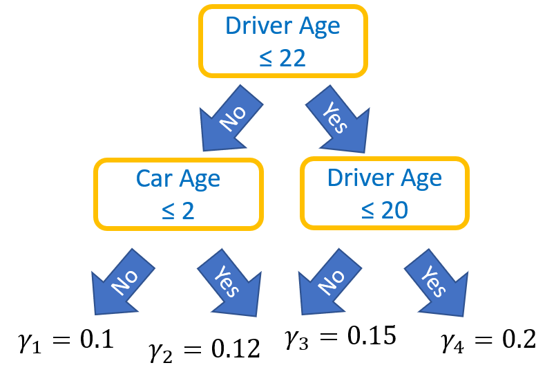
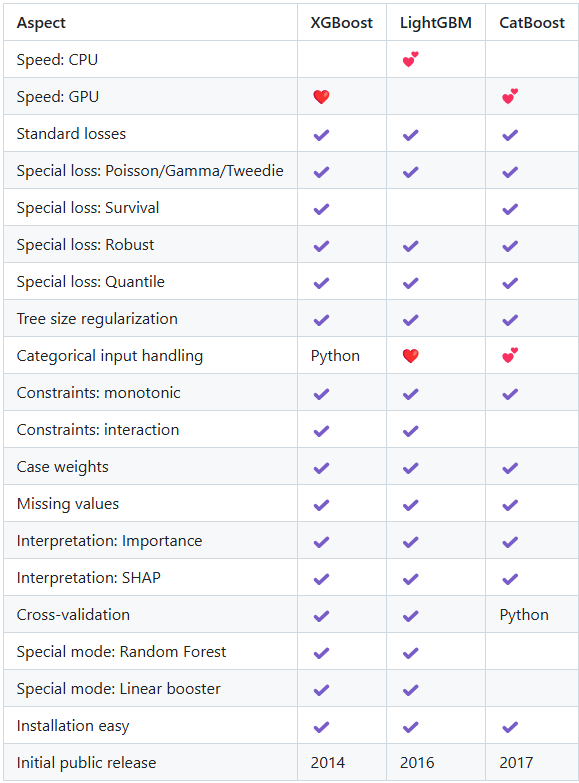

```{r setup, include=FALSE}
knitr::opts_chunk$set(
  echo = TRUE, 
  warning = FALSE, 
  message = FALSE,
  eval = TRUE
)
```

# Introduction

A decision tree is a simple, easy-to-interpret modeling technique for both regression and classification problems. Compared to other methods, decision trees usually do not perform very well. Their relevance lies in the fact that they are the building blocks of two of the most successful ML algorithms: random forests and gradient boosted trees. In this chapter, we will introduce these tree-based methods. For more background, the reader is referred to the main references @hastie01statisticallearning and @james2021.

# Decision Trees

## How they work

On our journey to estimate the model $f$ by $\hat f$, we have so far mainly considered linear functions $f$. We now turn to another class of functions: decision trees. They were introduced in @breiman1984 and are sometimes called "Classification and Regression Trees" (CART). 

(Binary) decision trees are computed recursively by partitioning the data into two parts. Partitions are chosen to optimize total loss by asking the best "yes/no" question about the covariates, e.g.: Is the age of the driver $\le 22$?

{width=50%}

For regression problems, the most frequently used loss function $L$ is the squared error.
For classification, it is "information" (= cross-entropy = log loss = half the unit logistic deviance) or the very similar Gini impurity.

Predictions are computed by sending an observation down the tree, starting with the question at the "trunk" and ending in a leaf, say in leaf $j$. The prediction is the value $\gamma_j$ associated with that leaf. In regression situations, $\gamma_j$ usually corresponds to the average response of all training observations that fall into that leaf. In classification situations, it may be the most frequent class in the leaf or the vector of class probabilities.

More formally, let $R_1, \dots, R_J$ denote the terminal regions corresponding to the $J$ leaves in the sense that $\boldsymbol x$ falls in leaf $j \Leftrightarrow \boldsymbol x \in R_j$. Then, the prediction function can be expressed as
$$
  \hat f(\boldsymbol x) = \sum_{j = 1}^{J} \gamma_j \boldsymbol 1\{\boldsymbol x \in R_j\}.
$$

The concept of a decision tree is best understood with an example.

## Example

We will use the `dataCar` data set to predict the claim probability with a decision tree. As features, we use `veh_value`, `veh_body`, `veh_age`, `gender`, `area` and `agecat`.

```{r}
library(rpart)
library(rpart.plot)
library(insuranceData)

data(dataCar)

fit <- rpart(
  clm ~ veh_value + veh_body + veh_age + gender + area + agecat, 
  data = dataCar,
  method = "class", 
  parms = list(split = "information"),
  xval = 0,
  cp = -1,
  maxdepth = 3
)

prp(fit, type = 2, extra = 7, shadow.col = "gray",
    faclen = 0, box.palette = "auto", branch.type = 4, 
    varlen = 0, cex = 0.9, digits = 3, split.cex = 0.8)

dataCar[1, c("agecat", "veh_value", "veh_body")]
predict(fit, dataCar[1, ])
```

**Comments**

- The first observation belongs to a person in age category 2 and has a $10'600 hatchback: the first question sends us to the right, the second to the left and the third to the right. This gives us a claim probability of 6.7%.
- For example, how was the first question (`agecat >= 5`) selected? The algorithm searches all covariates for all possible split positions and selects the one with the best total loss improvement. In this case, the split on the covariate `agecat` at the value 5 reduced the total loss the most. As loss function, we used "information", which is equivalent to (half) the unit logistic deviance.

## Properties

Here, we list a couple of properties of decision trees.

- **Outliers:** In contrast to linear models, outliers in covariates are not an issue because the algorithm only takes into account the sort order of the values. Similarly, taking logarithms or other monotone transformations of covariates has no effect. Both statements do not hold for the response variable.
- **Missing values:** Some implementations can deal with missing values in the input. Alternatively, missing values are often replaced by a typical value or a value smaller/larger than the smallest non-missing value (such as -1 for a positive variable).
- **Categorical covariates:** Unordered categorical covariates are difficult to split, since $\ell$ levels theoretically give rise to $2^\ell$ possible partitions. Try grouping small categories together, or consider representing the levels by ordered categories (even if it does not make too much sense). One-hot-encoding is also an option. Some algorithms provide ways to handle unordered categories internally.
- **Greedy:** Partitions are made in a greedy way to optimize the objective in *one split*. Looking ahead more than one split would lead to better models but is not feasible from a computational point of view.
- **Interactions:** By their flexible structure, a decision tree can automatically capture interaction effects of any order (and other non-linear effects), at least if the data set is large and the tree is deep enough. This is a clear advantage of tree-based methods compared to linear models, where these elements must be carefully and manually selected. In the next chapter, we will meet another model class with this advantage: neural nets.
- **Extrapolation:** By construction, a decision tree cannot extrapolate. Thus, even a diamond weighing 10 carats cannot get a higher price prediction than the most expensive diamond in the training data. In fact, it will be even lower (why?).
- **Instability:** A small change in the data can result in a completely different tree. The reason for this is that a change in an early split also affects later splits. Averaging many trees reduces this variance, which leads us to random forests.

These properties (except the last one) translate to combinations of trees like random forests or boosted trees.

Before we delve into these tree ensemble techniques, here is a [short video](https://www.youtube.com/watch?v=8hupHmBVvb0) of Jerome Friedman explaining how he tried to efficiently approximate nearest neighbor and came up with a new method: decision trees.

# Random Forests

In 2001, Leo Breiman introduced a powerful tree-based algorithm called *random forest* [@breiman2001]. A random forest consists of many decision trees. The trees differ for two reasons. One of them is an *ensembling* technique called "bagging". Before studying random forests, we first have a look at bagging.

## Bagging

Combining multiple models (*base learners*) into a single one is a common technique to slightly improve the overall performance of a model. This is referred to as *model ensembling*. For example, one could create an ensemble model by running multiple $k$-nearest neighbor regression models, each with a different value for $k$ (e.g., 5, 6, 7), and then averaging the resulting predictions. The combined model predictions tend to have lower variance and thus often a better out-of-sample performance, just like a diversified stock portfolio. 

Another way of creating an ensemble model is based on the Bootstrap: *Bagging* (from "**b**ootstrap **agg**regat**ing**) draws $B$ bootstrap samples and fits a model on each of those samples. The resulting $B$ models are then combined to a single one.

**Algorithm: bagging** (for regression)

1. Select $B$ bootstrapped training data sets from the original training data.
2. Fit models $\hat f^{*j}(\boldsymbol x)$ on them.
3. Return the bagged model 
  $$
    \hat f(\boldsymbol x) = \frac{1}{B} \sum_{j = 1}^B \hat f^{*j}(\boldsymbol x)
  $$

For classification, the last step is replaced by taking averages for each predicted probability or doing majority voting.

### Example

Let's try out the idea of bagging using diamonds data. We first fit a relatively deep decision tree on the training data without bagging. This is our reference model. Then, we fit a tree on each of 20 bootstrapped versions of the training data. In order to evaluate the results, we store the validation predictions of each of the 20 bootstrapped models. We evaluate them by taking their successive means (averaging the predictions of the first $b$ models for $b = 1, \dots, 20$).

```{r}
library(rpart)
library(tidyverse)
library(withr)

RMSE <- function(y, pred) {
  sqrt(mean((y - pred)^2))
}

diamonds <- transform(diamonds, log_price = log(price), log_carat = log(carat))

# Split diamonds into 80% for "training" and 20% for validation
with_seed(
  9838,
  ix <- sample(nrow(diamonds), 0.8 * nrow(diamonds))
)

train <- diamonds[ix, ]
valid <- diamonds[-ix, ]

# Tree without bagging for comparison
form <- log_price ~ log_carat + clarity + color + cut
fit_unbagged <- rpart(form, data = train, xval = 0, cp = -1, maxdepth = 8)
rmse_unbagged <- RMSE(valid$log_price, predict(fit_unbagged, valid))

# Fit B models on B bootstrap samples and store their predictions on the validation data
# (one column per bootstrap sample)
B <- 20
valid_pred <- matrix(nrow = nrow(valid), ncol = B)
for (j in 1:B) {
  data_boot <- train[sample(nrow(train), replace = TRUE), ]
  fit_boot <- rpart(form, data = data_boot, xval = 0, cp = -1, maxdepth = 8)
  valid_pred[, j] <- predict(fit_boot, valid)
}

# Very high correlations across models (subset of three models shown)
round(cor(valid_pred[, 1:3]), 3)

# Rowwise successive mean predictions
pred_bagged <- t(apply(valid_pred, 1, function(z) cumsum(z) / 1:length(z)))

# Validation RMSE per column
rmse_bagged <- apply(pred_bagged, 2, function(z) RMSE(valid$log_price, z))

# Visualization
rmse_bagged %>% 
  as_tibble_col("Validation RMSE") %>% 
  mutate(`Bagging round` = row_number()) %>% 
ggplot(aes(`Bagging round`, `Validation RMSE`)) +
  geom_point(color = "chartreuse4") +
  geom_hline(yintercept = rmse_unbagged)
```

**Comments** 

- The more bagging rounds, the better the validation performance.
- Already after two bagging rounds, performance is better compared with the unbagged model (straight black line). 
- The effect tails off.
- The predictions of the 20 models are extremely strongly correlated. Still, they are not perfectly correlated, so there *is* some diversification going on.

**Remarks on bagging**

- *Base learners*: Bagging works best with unstable models like deep decision trees as base learners. In principle, it can also be applied to any other modeling technique, e.g, linear regression. 
- *OOB validation*: In each tree, about 1/3 of the observations are not included in the bootstrap sample. Put differently: each observation is used in about 2/3 of all models. If its prediction is calculated from the other 1/3 of the models, we get an "out-of-sample" prediction, also called "out-of-bag" (OOB) prediction. If rows are independent, the performance measure derived from these OOB predictions is usually a good estimate of true performance, replacing (cross-)validation. Do not trust OOB results when rows are dependent, such as with grouped rows.
- *Parallel computing:* Since the models can be fitted fully independently, bagging is ideal for parallel computing.
- *Performance versus complexity*: A bagged model consisting of $B$ base models takes $B$ times as long to train, is $B$ times as large, and is usually more difficult to interpret than a single model. Still, the performance gain is sometimes worth the effort. The same tradeoff applies to ensembling techniques in general.

### Bias-Variance Trade-Off

We have mentioned that ensemble models try to reduce variance to improve their test performance. But what does *variance* mean in this context? And why does a smaller variance leads to better test performance? For the MSE as performance measure, we have the following decomposition of the generalization error (@james2021):

$$
	\underbrace{\mathbb E(y_o - \hat f(x_o))^2}_{\text{Expected test MSE of } x_o} = \text{Var}(\hat f(x_o)) + \left[\text{Bias}(\hat f(x_o))\right]^2 + \underbrace{\text{Var}(\varepsilon)}_{\text{Irreducible error}},
$$
where

- $(y_o, x_o)$ is a specific observation,
- expectations and variances are calculated over a large number of training sets, and
- "Bias" is the error introduced by approximating true model by $f$.

Models with low bias (e.g. deep decision trees or $k$-nearest-neighbor with small $k$) usually have high variance. On the other hand, models with low variance (like linear regression) tend to have high bias. This is the famous *Bias-Variance Trade-Off*. A bagged decision tree tries to have low bias (deep trees) and low variance (from bagging).

## From bagging to random forests

To turn a bagged decision tree into a random forest, a second source of randomness is injected: *Each split* scans only a random selection "mtry" of the $p$ covariates to find the best split, usually $\sqrt{p}$ or $p/3$. "mtry" is the main tuning parameter of a random forest. This extra randomness further decorrelates the bagged trees, which improves the diversification effect. Properties of bagging also apply to random forests.

**Algorithm: random forest** (for regression)

1. Select $B$ bootstrapped training data sets from the original training data.
2. Fit (usually deep) decision trees $\hat f^{*j}(\boldsymbol x)$ on these. During each split, consider only a random subset of features.
3. Return the model 
  $$
    \hat f(\boldsymbol x) = \frac{1}{B} \sum_{j = 1}^B \hat f^{*j}(\boldsymbol x).
  $$

For classification, the last step is again replaced by taking averages for each predicted probability or doing majority voting.

**Comments about random forests**

- **Number of trees:** Usually, $100-1000$ trees are being grown. The more, the better. More trees also mean longer training time and larger models.
- **Deep trees and diversification:** Single trees in a random forest are usually deep, thus they overfit on the training data. It is the diversity across trees that produces a good and stable model, just like a well-diversified stock portfolio. 
- **Never trust performance on the training set for random forests.** The reason is the overfitting caused by the deep decision trees. Besides using the standard approaches to assess true performance (simple or cross-validation), we can study OOB results.
- **Parameter tuning:** Random forests offer many tuning parameters. Since the results typically do not depend too much on their choice, untuned random forests are often great benchmark models, see also this [short video](https://www.youtube.com/watch?v=t8ooi_tJHSE) by Adele Cutler on working with Leo Breiman on random forests. (Remember: the main tuning parameter is "mtry").

### Example

Let us now fit a random forest for (logarithmic) diamond prices with default parameters and 500 trees. 80% of the data is used for training, the other 20% we use for evaluating the performance. (Throughout the rest of the lecture, we will ignore the problematic aspect of having repeated rows for some diamonds.)

```{r}
library(tidyverse)
library(withr)
library(ranger)
library(MetricsWeighted)

diamonds <- transform(diamonds, log_price = log(price), log_carat = log(carat))

y <- "log_price"
x <- c("log_carat", "color", "cut", "clarity")

# Train/test split
with_seed(
  9838,
  ix <- sample(nrow(diamonds), 0.8 * nrow(diamonds))
)

fit <- ranger(
  reformulate(x, y), 
  num.trees = 500,
  data = diamonds[ix, ], 
  importance = "impurity",
  seed = 83
)
fit

# Performance on test data
pred <- predict(fit, diamonds[-ix, ])$predictions
y_test <- diamonds[-ix, y]
rmse(y_test, pred)
r_squared(y_test, pred)

# Size of the fitted model
format(object.size(fit), units = "auto")
```

**Comments**

- Performance is much better than with bagging alone. Besides the random feature selection, the main reason for this is that very deep decision trees are grown.
- The OOB estimate of performance is extremely close to the test set performance.
- How can we interpret a complex model like this?
- The model fills about 130 MB of RAM. This is a lot, given the fact that the diamonds data is not too large.

## Interpreting a black box

In contrast to a single decision tree or a linear model, a combination of many trees is not easy to interpret. It is good practice for any ML model to not only study 

1. performance, but also  
2. variable importance, and 
3. feature effects. 

A pure prediction machine is hardly of any interest and might even contain mistakes like using covariates derived from the response. Model interpretation helps to fight such problems and thus also to increase trust in a model and its creator. The field of ML/statistics caring about interpreting complex models is called XAI (from e*X*plainable *A*rtificial *I*ntelligence). We present some of the methods here, and some other later in the chapter on neural networks.

Most of the text of this section is adapted from the [responsible ML lecture]( https://github.com/lorentzenchr/responsible_ml_material).

### Variable importance

There are different approaches to measure the importance of a covariate. Since no general mathematical definition of "importance" exists, the results of different approaches might be inconsistent across each other. For tree-based methods, a usual approach is to measure how many times a covariate $X^{(j)}$ was used in a split or how much total loss improvement came from splitting on $X^{(j)}$. For a GLM, we could study partial Chi-squared tests (model with feature $X^{(j)}$ versus model without).

Approaches that work for *any* supervised model include *permutation importance* (see later) and *SHAP importance* (not covered).

#### Example: Random forest (continued)

Let us study relative split gain importance regarding MSE improvement for the features in our random forest.

```{r}
imp <- sort(importance(fit))
imp <- imp / sum(imp)
barplot(imp, horiz = TRUE, col = "chartreuse4")
```

**Comment**: As expected, logarithmic carat is by far the most important feature.

### Effects

One of the advantages of an *additive* linear regression over a complex ML model is its simple structure. The coefficient(s) of a feature $X^{(j)}$ immediately tells us how predictions will react on changes in $X^{(j)}$, keeping all other covariates fixed ("Ceteris Paribus"). Due to additivity, the effect of $X^{(j)}$ is the same for all observations. 

But what if the linear regression contains complex interaction effects? Or if the model is an ML model such as a random forest or $k$-nearest neighbor? Options include studying individual conditional expectations and/or partial dependence plots.

#### Individual conditional expectations

The *individual conditional expectation (ICE)* function [@goldstein2015] for covariate $X^{(j)}$ of model $f$ and an observation with covariate vector $\boldsymbol x \in {\mathbb R}^p$ is given by 
$$
  \text{ICE}_j: v \in {\mathbb R} \mapsto f(v, \boldsymbol x_{\setminus j}),
$$
where $\boldsymbol x_{\setminus j}$ denotes all but the $j$-th component of $\boldsymbol x$, which is being replaced by the value $v$.

The corresponding ICE *curve* represents the graph $(v, \text{ICE}_j(v))$ for a grid of values $v \in \mathbb R$. An ICE *plot* finally shows the ICE curves of many observations.

**Remarks**

- The more different the curves in an ICE plot for covariate $X^{(j)}$ (ignoring vertical shifts), the stronger the interaction effects with other covariates. 
- If there are no interaction effects between $X^{(j)}$ and the other covariates (additive feature), the curves are parallel. If such covariate is represented by a linear function with slope $\beta$, the ICE curves will have slope $\beta$ as well.
- ICE curves can be vertically centered to focus on interaction strength. These curves are called "c-ICE" curves. For a model additive in $X^{(j)}$, the c-ICE plot of $X^{(j)}$ shows a single curve.
- If the model $f$ involves a link function, ICE curves are often plotted on the link scale (why?).

**Pros and Cons**

- Pro: Very simple to compute.
- Pro: Easy to interpret thanks to Ceteris Paribus logic.
- Pro: Gives an impression about associated interaction strength.
- Con: Suboptimal when Ceteris Paribus clause is unnatural.
- Con: Model is applied to rare/impossible feature value combinations.
- Con: One does not see which variable is interacting.

##### Example: Random forest (continued)

How do ICE and c-ICE plots for two selected features look?

```{r}
library(flashlight)

# Explainer object
fl <- flashlight(
  model = fit, 
  data = diamonds[ix, ], 
  label = "Random forest", 
  predict_function = function(m, X) predict(m, X)$predictions
)

# ICE and c-ICE plots of log_carat and clarity
v <- "log_carat"
light_ice(fl, v = v, n_max = 200) %>% 
  plot(alpha = 0.2, color = "chartreuse4") +
  labs(title = paste("ICE plot for", v), y = "Prediction")

light_ice(fl, v = v, n_max = 200, center = "middle") %>% 
  plot(alpha = 0.1, color = "chartreuse4") +
  labs(title = paste("c-ICE plot for", v), y = "Centered prediction")

v <- "clarity"
light_ice(fl, v = v, n_max = 200) %>% 
  plot(alpha = 0.2, color = "chartreuse4") +
  labs(title = paste("ICE plot for", v), y = "Prediction")

light_ice(fl, v = v, n_max = 200, center = "middle") %>% 
  plot(alpha = 0.1, color = "chartreuse4") +
  labs(title = paste("c-ICE plot for", v), y = "Centered prediction")
```

**Comments**

- ICE plot for `log_carat`: The curves are increasing, which makes sense: everything else fixed, the expected (log) price increases with (log) carat. For very large values of log carat, predictions tail off. This is not realistic but a consequence of the fact that tree-based models cannot extrapolate.
- c-ICE plot for `log_carat`: Vertical scatter is not strong, indicating weak interaction effects. If our model would use `price` as response, the interaction effects would be much stronger (why?).
- `clarity`: Better clarity is associated with higher predictions. This trend is easier to see in the centered ICE plot. There, we can also see strong interaction effects (some curves are much steeper than others, etc.). 

#### Partial dependence

The pointwise average of many ICE curves is called a *partial dependence plot* (PDP), originally introduced by @friedman2001 in his seminal work on gradient boosting. It describes the effect of the variable $X^{(j)}$, averaged over all interaction effects and holding all other variables fixed. The empirical partial dependence function for model $\hat f$ and feature $X^{(j)}$ is given by
$$
  \text{PD}_j(v) = \frac{1}{n} \sum_{i = 1}^n \hat f(v, \boldsymbol x_{i,\setminus j}),
$$
where $\boldsymbol x_{i,\setminus j}$ denotes the feature vector without $j$-th component of observation $i$ in some reference dataset, often the training or the test data.

The corresponding PDP represents the graph $(v, \text{PD}_j(v))$ for a grid of values $v \in \mathbb R$.

**Pros and Cons**

- Pro: Simple to compute.
- Pro: Easy to interpret thanks to Ceteris Paribus logic.
- Con: Suboptimal when Ceteris Paribus clause is unnatural.
- Con: Model is applied to rare/impossible feature value combinations.
- Con: No information about interactions.

An alternative to the partial dependence plot, the *accumulated local effects* (ALE) plot [@apley2016], attempts to overcome the first two (related) downsides. However, ALE plots are more difficult to calculate and to interpret. We will not consider them here.

##### Example: Random forest (continued)

Let us now study the partial dependence plots of all features.

```{r}
for (v in x) {
  p <- light_profile(fl, v = v, n_bins = 40) %>% 
    plot(color = "chartreuse4") +
    labs(title = paste("PDP for", v), y = "Prediction") 
  print(p)
}
```

**Comment:** All effects as assessed by partial dependence plots make sense.

# Gradient Boosted Trees

Another way of combining decision trees to an ensemble model are gradient boosted trees. They belong to the most successful ML models. We will first explain what boosting is. Then, we introduce the gradient boosted trees algorithm.

## Boosting

The idea of *boosting* was investigated e.g. in @schapire1990 and could be described as follows:

1. Fit simple model $\hat f$ to data.
2. For $k = 1, \dots, K$ do:
   a. Find simple model $\hat f^k$ that corrects the mistakes of $\hat f$.
   b. Update: $\hat f \leftarrow \hat f + \hat f^k.$
  
As base learners (or weak learners) $f^k$, often short decision trees are used. But how to find them specifically? 

- **AdaBoost:** In 1995, Freund and Schapire proposed the famous AdaBoost algorithm for binary classification. It combines decision trees with a particular reweighting scheme. 

- **Gradient boosting:** While AdaBoost is still in use, the most common way to find the updates $\hat f^k$ goes back to Jerome Friedman and his article on Gradient Boosting Machines [@friedman2001]. The key idea of gradient boosting is to choose $\hat f^k$ to make the total loss $Q(\hat f + \hat f^k) = \sum_{i = 1}^n L(y_i, \hat f(\boldsymbol x_i) + \hat f^k (\boldsymbol x_i))$ smaller. 

## Gradient boosting

Gradient boosting is gradient descent in function space. Gradient descent is a numerical method to find the (local) minimum of a smooth function $h: \mathbb R^n \to \mathbb R$. It works as follows:

1. Start at some value $\hat x \in \mathbb R^n$.
2. Repeat: $\hat x \leftarrow \hat x - \lambda g$.

$\lambda > 0$ is the step size or learning rate, and
$$
  g = \left[\frac{\partial h(x)}{\partial x}\right]_{x = \hat x}
$$
is the gradient of $h$ at $\hat x$. 

It points in the direction of the steepest ascent, so the update step goes in the opposite direction to make $h$ smaller. Imagine you are standing on a hill in foggy weather: which direction should you go to get down? You look for the direction in which the hill is steepest, and then take a step in the opposite direction, and so on.

The following picture on [Wikipedia](https://en.wikipedia.org/wiki/Gradient_descent) illustrates the situation:

{width=50%}

Let's apply gradient descent to the total loss 
$$
  Q(f) = \sum_{i = 1}^n L(y_i, f(\boldsymbol x_i))
$$
viewed as a function of the $n$ parameters 
$$
  f = \left(f(\boldsymbol x_1), \dots, f(\boldsymbol x_n)\right) \in \mathbb R^n,
$$
i.e. of the $n$ predictions on the training data.

We proceed as in standard gradient descent:

1. Start at some value $\hat f$.
2. Repeat: $\hat f \leftarrow \hat f - \lambda g$ with
$$
  g = \left[\frac{\partial Q(f)}{\partial f}\right]_{f = \hat f}
$$
having components
$$
  g_i = \left[\frac{\partial L(y_i, f(\boldsymbol x_i))}{\partial f(\boldsymbol x_i)}\right]_{f(\boldsymbol x_i) = \hat f(\boldsymbol x_i)}.
$$

For the squared error loss $L(y, z) = (y-z)^2/2$, these components equal
$$
		g_i = -(\underbrace{y_i - \hat f(\boldsymbol x_i)}_{\text{Residual } r_i}),
$$
i.e., the gradient descent updates equal 
$$
  \hat f(\boldsymbol x_i) \leftarrow \hat f(\boldsymbol x_i) + \underbrace{\lambda r_i}_{\hat f^k \text{?}}.
$$
Does this mean that the update steps in gradient boosting are $\hat f^k = -\lambda g_i$? This would not make sense for two major reasons:

1. $y_i$ and thus $g_i$ are unknown at prediction stage.
2. The model should be applicable not only to $\boldsymbol x \in \{\boldsymbol x_1, \dots, \boldsymbol x_n\}$. Rather we would like to apply it to any $\boldsymbol x$.

The solution is to replace $-g_i$ by predictions of a decision tree (or of another base learner) with covariates $\boldsymbol X$. This leads us to the following algorithms (slightly modified from @hastie01statisticallearning):

**Algorithm: Gradient boosted trees for the squared error loss**

1. Initialize $\hat f(\boldsymbol x) = \frac{1}{n}\sum_{i = 1}^{n} y_i$
2. For $k = 1, \dots, K$ do:
    a. For $i = 1, \dots, n$, calculate residuals $r_i = y_i - \hat f(\boldsymbol x_i)$
	  b. Model the $r_i$ as a function of the $\boldsymbol x_i$ by fitting a regression tree $\hat f^k$ with squared error loss
	  c. Update: $\hat f(\boldsymbol x) \leftarrow \hat f(\boldsymbol x) + \lambda \hat f^k(\boldsymbol x)$
3. Output $\hat f(\boldsymbol x)$

For general loss functions, the algorithm is a bit more complicated:
	
- The residuals are replaced by negative gradients of the loss function $L$.
- Leaf values might be suboptimal $\rightarrow$ replace by optimal values.

**Algorithm: Gradient boosted trees for general loss functions** 

1. Initialize $\hat f(\boldsymbol x) = \text{argmin}_\gamma \sum_{i = 1}^{n} L(y_i, \gamma)$
2. For $k = 1, \dots, K$ do:
    a. For $i = 1, \dots, n$, calculate negative gradients (pseudo-residuals)
			$$
			r_i = -\left[\frac{\partial L(y_i, f(\boldsymbol x_i))}{\partial f(\boldsymbol x_i)}\right]_{f(\boldsymbol x_i) = \hat f(\boldsymbol x_i)}
			$$
    b. Model $r_i$ as function of $\boldsymbol x_i$ by regression tree $\hat f^k$ with terminal regions $R_1, \dots, R_J$, using squared error loss
    c. For each $j = 1, \dots, J$, use line-search to find the optimal leaf value 
			$$
			\gamma_j = \text{argmin}_{\gamma} \sum_{\boldsymbol x_i \in R_j} L(y_i, \hat f(\boldsymbol x_i) + \gamma)
			$$
    d. Update: $\hat f(\boldsymbol x) \leftarrow \hat f(\boldsymbol x) + \lambda \underbrace{\sum_{j = 1}^{J} \gamma_j \boldsymbol 1\{\boldsymbol x \in R_j\}}_{\text{modified tree}}$
3. Output $\hat f(\boldsymbol x)$


**Remarks**

- Predictions are made by the final model $\hat f(\boldsymbol x)$, which equals a sum of decision trees whose leaf values have been replaced.
- While a random forest equals the average of many deep trees, a boosted trees model equals the sum of many shallow trees.
- We will see later how to select the learning rate $\lambda$, the number of trees $K$, and further parameters.
- For classification models with more than two categories, the algorithm needs to be slightly extended, but the idea is the same.
- AdaBoost (Freund and Schapire, 1995) is gradient tree boosting with a special (exponential) loss.

## Modern implementations

Modern implementations of gradient boosted trees include [XGBoost](https://xgboost.readthedocs.io/en/latest/), [LightGBM](https://lightgbm.readthedocs.io/en/latest/), and [CatBoost](https://catboost.ai/). These are the predominant algorithms in ML competitions on tabular data, check [this comparison](https://github.com/mayer79/gradient_boosting_comparison) for differences with a screenshot as per October 10, 2022:

. 

They differ from Friedman's original approach in multiple ways, e.g.:

- Second order gradients: XGBoost introduced the use of second order gradients, mainly removing the line-search step for all loss functions, see  @chen2016 or [this slide deck](https://web.njit.edu/~usman/courses/cs675_spring20/BoostedTree.pdf) from Tianqi Chen.
- Histogram binning: LightGBM [@ke2017], a very fast competitor of XGBoost, introduced histogram binning: Continuous covariates are binned into a histogram (e.g. in $B = 255$ bins) before training, and their values are replaced by short unsigned integers representing the corresponding bin number. During tree growth, to determine the best split position of a given covariate, at most $B$ split positions must be evaluated instead of evaluating the loss gain for all unique feature values. This significantly speeds up tree construction. To activate histogram binning also for XGBoost, set `tree_method = "hist"`
- Possibility to penalize the objective function.

### Example: XGBoost

As an initial example on gradient boosting and XGBoost, we fit a model for diamond prices with squared error as loss function and RMSE as corresponding evaluation metric. The number of rounds/trees is chosen by early stopping on the validation data, i.e., until validation RMSE stops improving for a couple or rounds. The learning rate (weight of each tree) is chosen by trial and error in order to end up with a reasonable number of trees, see the next section for more details.

```{r}
library(ggplot2)
library(withr)
library(xgboost)

diamonds <- transform(diamonds, log_price = log(price), log_carat = log(carat))

y <- "log_price"
x <- c("log_carat", "color", "cut", "clarity")

# Split into train and valid
with_seed(
  9838,
  ix <- sample(nrow(diamonds), 0.8 * nrow(diamonds))
)

y_train <- diamonds[ix, y]
X_train <- diamonds[ix, x]

y_valid <- diamonds[-ix, y]
X_valid <- diamonds[-ix, x]

# XGBoost data interface
dtrain <- xgb.DMatrix(data.matrix(X_train), label = y_train)
dvalid <- xgb.DMatrix(data.matrix(X_valid), label = y_valid)

# Minimal set of parameters
params <- list(
  learning_rate = 0.1,
  objective = "reg:squarederror",
  eval_metric = "rmse"
)
  
# Fit model until validation RMSE stops improving over the last 20 rounds
fit <- xgb.train(
  params = params, 
  data = dtrain, 
  watchlist = list(train = dtrain, valid = dvalid),
  print_every_n = 50,
  nrounds = 5000, 
  early_stopping_rounds = 20
)
```

**Comments:** 

- More trees would mean better training performance but poorer validation performance.
- Compared to simple validation, cross-validation would provide an even better way to find the optimal number of boosting rounds/trees.

## Parameter tuning

Gradient boosted trees offer many parameters to select from. Unlike with random forests, they need to be tuned to achieve good results. It would be naive to use an algorithm like XGBoost without parameter tuning. Here is a selection:

- **Number of boosting rounds $K$:** In contrast to random forests, more trees/rounds is not always beneficial because the model begins to overfit after some time. The optimal number of rounds is usually found by early stopping, i.e., one lets the algorithm stop as soon as the (cross-)validation performance stops improving, see the example above.

- **Learning rate $\lambda$:** The learning rate determines the training speed and the impact of each tree to the final model. Typical values are between 0.001 and 1. In practical applications, it is set to a value that leads to a reasonable amount of trees ($100 - 1000$). Usually, halving the learning rate means twice as much boosting rounds for comparable performance.

- **Regularization parameters:** Depending on the implementation, additional parameters are
    - the tree depth (often $3 - 7$) or the number of leaves (often $7 - 63$), 
    - the strength of the L1 and/or L2 penalties added to the objective function (often between 0 and 5), 
    - the per-tree row subsampling rate (often between 0.8 and 1), 
    - the per-tree or per-split column subsampling rate (often between 0.6 and 1), 
    - ...
  
    Reasonable regularization parameters are chosen by trial and error or systematically by randomized/grid search CV. Usually, it takes a couple of manual iterations until the range of the parameter values have been set appropriately.
    
Overall, the **modeling strategy** could be summarized as follows:

1. Using default regularization parameters, set the learning rate to get a reasonable number of trees with CV-based early stopping.
2. Use randomized search CV with early stopping to tune regularization parameters such as tree depth. Iterate if needed.
3. Use the best parameter combination (incl. number of trees) to fit the model on the training data. "Best" typically means in terms of CV performance. As mentioned in the last chapter and depending on the situation, it can also mean "good CV performance and not too heavy overfit compared to insample performance" or some other reasonable criterion.

Remark: Since the learning rate, the number of boosting rounds, and other regularization parameters are highly interdependent, a large randomized grid search to select the learning rate, boosting rounds, and regularization parameters is often not ideal. Above suggestion (fix learning rate, select number of rounds by early stopping and do grid search only on regularization parameters) is more focused, see also the example below.

### Example: XGBoost

We will use XGBoost to fit diamond prices using the squared error as loss function and RMSE as corresponding evaluation metric, now using a sophisticated tuning strategy.

```{r}
# This code is pretty long. It may serve as a general template to fit a
# high-performance XGBoost model
library(tidyverse)
library(withr)
library(xgboost)

diamonds <- transform(diamonds, log_price = log(price), log_carat = log(carat))

y <- "log_price"
x <- c("log_carat", "color", "cut", "clarity")

# Split into train and test
with_seed(
  9838,
  ix <- sample(nrow(diamonds), 0.8 * nrow(diamonds))
)

y_train <- diamonds[ix, y]
X_train <- diamonds[ix, x]

y_test <- diamonds[-ix, y]
X_test <- diamonds[-ix, x]

# XGBoost data interface
dtrain <- xgb.DMatrix(data.matrix(X_train), label = y_train)

# If grid search is to be run again, set tune <- TRUE
tune <- FALSE

if (tune) {
  # Use default parameters to set learning rate with suitable number of rounds
  params <- list(
    learning_rate = 0.1,
    objective = "reg:squarederror",
    eval_metric = "rmse"
  )
  
  # Cross-validation
  cvm <- xgb.cv(
    params = params,
    data = dtrain,
    nrounds = 5000,
    nfold = 5,
    early_stopping_rounds = 20, 
    showsd = FALSE, 
    print_every_n = 50
  )
  cvm   # -> a lr of 0.1 provides about 200 trees, which is a convenient amount
   
  # Final grid search after some iterations
  grid <- expand.grid(
    iteration = NA,
    cv_score = NA,
    train_score = NA,
    learning_rate = 0.1,
    objective = "reg:squarederror",
    eval_metric = "rmse",
    max_depth = 6:7, 
    min_child_weight = c(1, 10),
    colsample_bytree = c(0.8, 1), 
    subsample = c(0.8, 1), 
    reg_lambda = c(0, 2.5, 5, 7.5),
    reg_alpha = c(0, 4),
    # tree_method = "hist",   # when data is large
    min_split_loss = c(0, 1e-04)
  )

 # Grid search or randomized search if grid is too large
  max_size <- 20
  grid_size <- nrow(grid)
  if (grid_size > max_size) {
    grid <- grid[sample(grid_size, max_size), ]
    grid_size <- max_size
  }

  # Loop over grid and fit XGBoost with five-fold CV and early stopping
  pb <- txtProgressBar(0, grid_size, style = 3)
  for (i in seq_len(grid_size)) {
    cvm <- xgb.cv(
      params = as.list(grid[i, -(1:2)]),
      data = dtrain,
      nrounds = 5000,
      nfold = 5,
      early_stopping_rounds = 20,
      verbose = 0
    )
    
    # Store result
    grid[i, 1] <- cvm$best_iteration
    grid[i, 2:3] <- cvm$evaluation_log[, c(4, 2)][cvm$best_iteration]
    setTxtProgressBar(pb, i)
  
    # Save grid to survive hard crashs
    saveRDS(grid, file = "simulation/diamonds_xgb.rds")
  }
}

# Load grid and select best iteration
grid <- readRDS("simulation/diamonds_xgb.rds")
grid <- grid[order(grid$cv_score), ]
head(grid)

# Fit final, tuned model
fit <- xgb.train(
  params = as.list(grid[1, -(1:3)]), 
  data = dtrain, 
  nrounds = grid[1, "iteration"]
)
```

Now, the model is ready to be inspected by evaluating 

- its test performance, 
- by looking at split gain importance and 
- partial dependence plots.

```{r}
library(MetricsWeighted)
library(flashlight)

# Performance on test data
pred <- predict(fit, data.matrix(X_test))
rmse(y_test, pred)
r_squared(y_test, pred, reference_mean = mean(y_train))

# Variable importance regarding MSE improvement
imp <- xgb.importance(model = fit)
xgb.plot.importance(imp, col = "chartreuse4")

# Partial dependence plots
fl <- flashlight(
  model = fit, 
  data = X_train, 
  label = "XGB", 
  predict_function = function(m, X) predict(m, data.matrix(X))
)

for (v in x) {
  p <- light_profile(fl, v = v, n_bins = 40) %>% 
    plot(color = "chartreuse4") +
    labs(title = paste("PDP for", v), y = "Prediction") 
  print(p)
}
```

**Comment**: Compared to the random forest, the test performance is slightly better. Effects seem to be comparable.

### Example: Taxi

We will now tune and fit a LightGBM model to predict (logarithmic) taxi trip durations, using the same covariates as in previous taxi models, and following the same basic tuning strategy as demonstrated for XGBoost. Instead of `max_depth`, the main regularization parameter of LightGBM is the number of leaf nodes.

Note: Since model tuning is slow, and the data is large, we could replace the 5-fold cross-validation by simple validation, e.g., using a 60%/20%/20% data split.

```{r}
library(arrow)
library(data.table)
library(withr)
library(tidyverse)
library(lightgbm)
library(MetricsWeighted)
library(flashlight)

df <- read_parquet("taxi/yellow_tripdata_2018-01.parquet")

setDT(df)
head(df)

#=======================================================================
# Prepare data for modeling
#=======================================================================

df[, duration := as.numeric(
    difftime(tpep_dropoff_datetime, tpep_pickup_datetime, units = "mins")
  )]
df = df[between(trip_distance, 0.2, 100) & between(duration, 1, 120)]
df[, `:=`(
  pu_hour = factor(data.table::hour(tpep_pickup_datetime)),
  weekday = factor(data.table::wday(tpep_pickup_datetime)), # 1 = Sunday
  pu_loc = forcats::fct_lump_min(factor(PULocationID), 1e5),
  log_duration = log(duration),
  log_distance = log(trip_distance)
)]

x <- c("log_distance", "weekday", "pu_hour", "pu_loc")
y <- "log_duration"

# Random split
with_seed(1, 
  ix <- sample(nrow(df), 0.8 * nrow(df))
)

y_train <- df[[y]][ix]
X_train <- df[ix, x, with = FALSE]

y_test <- df[[y]][-ix]
X_test <- df[-ix, x, with = FALSE]

# Data interface of LGB
dtrain <- lgb.Dataset(
  data.matrix(X_train),
  label = y_train,
  params = list(feature_pre_filter = FALSE)
)

grid_file <- "taxi/taxi_lgb.rds"

#=======================================================================
# Tune model using strategy outlined above (use as LightGBM template)
#=======================================================================

tune <- FALSE

if (tune) {
  # Select learning rate so that optimal number of rounds is
  # somewhere between 100 and 1000
  params <- list(
    learning_rate = 1,
    objective = "mse",
    num_threads = 7  # choose number of threads in line with your system
  )
  
  cvm <- lgb.cv(
    params = params,
    data = dtrain,
    nrounds = 1000,
    nfold = 5,
    early_stopping_rounds = 20,
    eval_freq = 50
  )

  # Random search
  grid <- expand.grid(
    iteration = NA,
    score = NA,
    learning_rate = 1,
    objective = "mse",
    metric = "rmse",
    num_leaves = c(15, 31, 63),
    min_data_in_leaf = c(20, 50, 100),
    min_sum_hessian_in_leaf = c(0, 0.001, 0.01),
    colsample_bynode = c(0.8, 1),
    bagging_fraction = c(0.8, 1),
    lambda_l1 = c(0, 4),
    lambda_l2 = c(0, 2.5, 5, 7.5),
    num_threads = 7,
    stringsAsFactors = FALSE
  )
  
  max_size <- 10
  grid_size <- nrow(grid)
  if (grid_size > max_size) {
    grid <- grid[sample(grid_size, max_size), ]
    grid_size <- max_size
  }
  
  pb <- txtProgressBar(0, grid_size, style = 3)
  for (i in seq_len(grid_size)) { # i <- 1
    cvm <- lgb.cv(
      params = as.list(grid[i, -(1:2)]),
      data = dtrain,
      nrounds = 5000,
      nfold = 5,
      early_stopping_rounds = 20,
      verbose = -1
    )
  
    # Store result
    grid[i, 1:2] <- as.list(cvm)[c("best_iter", "best_score")]
    setTxtProgressBar(pb, i)
  
    # Save grid to survive hard crashs
    saveRDS(grid, file = grid_file)
  }
}

#=======================================================================
# Fit model on best parameter combination
#=======================================================================

grid <- readRDS(grid_file) %>% 
  arrange(score)
head(grid)

# Fit model on best parameter combination
if (FALSE) {  # Set to true to refit
  fit_lgb <- lgb.train(
    params = as.list(grid[1, -(1:2)]), 
    data = dtrain, 
    nrounds = grid[1, "iteration"]
  )
  lgb.save(fit_lgb, "taxi/fit_lgb.txt")
} else{
  fit_lgb <- lgb.load("taxi/fit_lgb.txt")
}

#=======================================================================
# Inspect
#=======================================================================

# Performance on test data
pred <- predict(fit_lgb, data.matrix(X_test))
rmse(y_test, pred) # 0.3014
r_squared(y_test, pred, reference_mean = mean(y_train))

# Variable importance regarding MSE improvement
imp <- lgb.importance(model = fit_lgb)
lgb.plot.importance(imp)

fl <- flashlight(
  model = fit_lgb, 
  data = X_train, 
  label = "LGB", 
  predict_function = function(m, X) predict(m, data.matrix(X))
)

for (v in x) {
  p <- light_profile(fl, v = v, n_bins = 40) %>% 
    plot(color = "chartreuse4") +
    labs(title = paste("PDP for", v), y = "Prediction") 
  print(p)
}
```

**Comments**

- It takes long to tune a boosted trees model on many million data rows.
- The resulting model is better than the linear regression, which had an R-squared (without data split) of about 78%, but not dramatically.
- The effect of the dominating feature (`log_distance`) is realistic. Again, as with diamonds prices, we see that tree-based models do not have the capability to extrapolate a linear relationship. Depending on the application, this can be a problem.
- The effect of the hour of day is not intuitive. Why are the predictions at 12:00 as high as during rush-hour?

# Exercises

1. Explain in simple words: What is bagging? What is a random forest? What is out-of-bag performance?

2. Try to improve the random forest fitted on the diamonds data by playing with the `mtry` parameter. What does it do? Pick the `mtry` with best OOB performance. Does this improve the test performance?

3. Fit a random forest on the claims data for the binary variable `clm` using covariates `veh_value`, `veh_body`, `veh_age`, `gender`, `area`, and `agecat`. Choose a suitable tree depth either by cross-validation or by minimizing OOB error on the training data. Make sure to fit a *probability random forest*, i.e., predicting probabilities, not classes. Evaluate the final model on an independent test data set. (Note that the "ranger" package uses the "Brier score" as the evaluation metric for probabilistic predictions. In the binary case, is the same as the MSE.) Interpret the results by split gain importance and partial dependence plots. 

4. Consider the fully tuned XGBoost model for the diamonds data in the lecture notes above. Study the online documentation of XGBoost to figure out how to make the model monotonically increasing in `log_carat`. Test your approach without repeating the grid search part. How does the partial dependence plot for `log_carat` look now?

5. In the gradient boosted trees algorithm for the squared error, why do we fit a regression tree to the residuals instead of simply adding as new model the residuals itself?

6. (Optional) Develop an XGBoost model for the claims data set with binary response `clm`, and covariates `veh_value`, `veh_body`, `veh_age`, `gender`, `area`, and `agecat`. Use a clean cross-validation/test approach. Use log loss as loss function and evaluation metric. Interpret its results. You don't need to write all the code from scratch, but rather modify the XGBoost code from the lecture notes.

# Summary

In this chapter, we learned about decision trees, random forests, and tree boosting. Individual decision trees are very easy to interpret, but do not perform too well. Tree ensembles such as a random forest or gradient boosting trees, on the other hand, are usually very powerful but difficult to interpret. We have introduced interpretation tools to look inside such "black boxes". The main reason why random forests and boosted trees often provide more accurate models than a linear model is their ability to automatically learn interactions and other nonlinear effects.

# References
